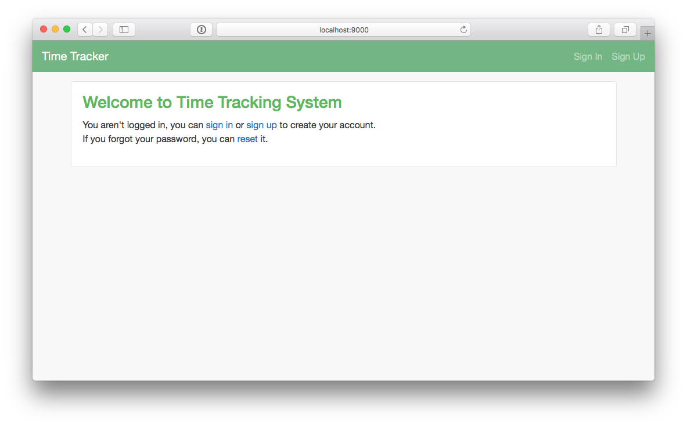

# Time Tracking System

A time tracking system for consulting firms. Features include:

* User signup/authentication
* Project, clients, vendors management
* Timesheets management
* Invoice management

## Future Work

* Expense Management

## Deploying

**Pre-requisites**

1. SBT: SBT is required for building the project and generating a tar ball (More details: http://goo.gl/cDMyog)
2. MongoDB: MongoDB is the backend database for this application, install, configure and start MongoDB (More details: https://goo.gl/LnTkFF)

**Main**

To deploy the application, follow these steps:

1. Clone the application

    ```
    git clone https://github.com/ashrithr/time-tracker.git
    cd time-tracker
    ```
    
2. Build the universal tar ball
    
    ```
    sbt universal:packageZipTarball
    ```
    
3. Extract the generated universal tarball to a convenient location, for example to `/opt`
    
    ```
    tar xzf target/universal/time-tracker-1.0-SNAPSHOT.tgz -C /opt
    ```
    
4. Configure the application, create `production.conf` configuration file in this path `/opt/time-tracker-1.0-SNAPSHOT/conf` directory of the application
    
    ```
    include "application.conf"
    
    # Generate your know secret key running `sbt playGenerateSecret`
    play.crypto.secret="SUPER_SECRET"
    
    mongodb.uri = "mongodb://localhost:27017/timetracker"
    
    # To allow specific domains during sign up, specify them here
    silhouette {
      authenticator.domains = [ "*" ]
    }
    
    # Setup your mailer configuration - below is an example for gmail. More info: https://goo.gl/HfYnC4
    play.mailer {
      host=smtp.gmail.com
      port=587
      ssl=false
      tls=true
      mock=false
      user="user@domain.com"
      password="password"
      from="admin@domain.com"
      reply="No reply <noreply@domain.io>"
    }
    
    # The following details are used to personalize the application
    company {
      name = "Company Inc"
      # nav bar settings
      nav-bar {
        background-color = "#72b781"
        text-color = "dark" # dark being white text and light being black text
      }
      logo {
        text = "Company"
        color = "#72b781"
      }
      address {
        street = "Street address"
        city = ""
        state = ""
        country = "USA"
        zip = 12345
      }
      contact {
        email = "user@doamin.io"
        phone = "1234567890"
      }
      # Bank details are used soley for generating invoices
      bank {
        name = "Bank Name"
        account {
          number = 11111111111
          routing = 11111111
        }
      }
    }
    ```
    
5. Start the application
    
    ```
    cd /opt
    nohup /opt/time-tracker-1.0-SNAPSHOT/bin/time-tracker -Dconfig.file=/opt/time-tracker-1.0-SNAPSHOT/conf/production.conf -Dhttp.port=80 &
    ```
    
    
## Screenshots
   
### Index
   

   
### User Management
   

   
### Timesheets
   
   